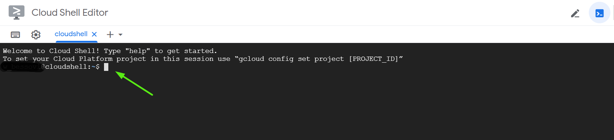

# Deploy GKE cluster

In this project, we will create a GKE (Google Kubernetes Engine) Cluster with 2 nodes and deploy a simple nginx web server on it.

<br>


> Estimated time for the deployment : **20-30 min**

## Pre-requisites
- Log in to the Google Cloud console
- Create a Google project [(how to create a gcloud project)](https://cloud.google.com/resource-manager/docs/creating-managing-projects#gcloud)

<br>


## Option 1 : Deploy GKE cluster step by step

**Open the Cloud Shell**


**Execute the following commands from the Cloud Shell**


**Set the configuration on the your project**
- Make sure the cloud shell is set on your project (in our example `gke-demo-cluster-cm`)
```
gcloud config set project gke-demo-cluster-cm
```

**Create GKE cluster default network**
```
gcloud compute networks create default
```

**Enable container apis**
```
gcloud services enable container.googleapis.com
```

**Set the region for the GKE cluster**
```
gcloud config set compute/zone europe-west2-a
```
- `europe-west2-a`: google region [(list of all the regions)](https://cloud.google.com/compute/docs/regions-zones?hl=fr)

**Create a GKE cluster**
- In our example we create a new GKE cluster with 2 nodes
```
gcloud container clusters create gke-cluster --num-nodes=2
```
**Configure kubectl to use the cluster**
```
gcloud container clusters get-credentials gke-cluster
```

**Run kubectl to display your nodes**
```
kubectl get nodes

Output

NAME                                         STATUS   ROLES    AGE     VERSION
gke-gke-cluster-default-pool-ef6c15c6-323p   Ready    <none>   2m48s   v1.16.15-gke.6000
gke-gke-cluster-default-pool-ef6c15c6-p89r   Ready    <none>   2m58s   v1.16.15-gke.6000
```

## Option 2 : Deploy GKE cluster with a shell script

Another option is to automate the deployment with this script

```
#!/bin/bash
# This script will deploy a new GKE cluster in a default network
# Please  provide the 6 arguments in this order PROJECT_ID, FOLDER_ID, BILLING, REGION, CLUSTER_NAME and NUMBER_OF_NODES

# Example : ./deploy-gke.sh gke-project-demo 422615538687 3461CD-G9A478-AF75C9 europe-west2-a gke-cluster1 2


# Variables
PROJECT_ID=${1} # The Google Project ID (example "gke-project-demo")
FOLDER_ID=${2} # the folder id  of the parent folder
BILLING=${3}  # the billing account number you want to associate the project
REGION=${4}  # The Region where the cluster is deployed (example "europe-west2-a")
CLUSTER_NAME=${5} # The name of the cluster (example "gke-cluster1")
NUMBER_OF_NODES=${6} # The number of nodes (example "2")

usage() {
 echo "Usage: ${0} [PROJECT_NAME] [FOLDER_ID] [BILLING_ACCOUNT] [REGION] [CLUSTER_NAME] [NUMBER_OF_NODES] " >&2
 echo "Example :"
 echo
 echo " ./deploy-gke.sh gke-project-demo 422615538687 3461CD-G9A478-AF75C9 europe-west2-a gke-cluster1 2"
 echo
 exit 1
}

if [[ "${#}" -lt 6 ]]
then
    usage
fi

# Create a  new project
gcloud projects create ${PROJECT_ID} --folder=${FOLDER_ID} |& cat -n


# Link new project to existing billing account
gcloud alpha billing projects link ${PROJECT_ID} --billing-account ${BILLING}

# Set the configuration of your project
gcloud config set project ${PROJECT_ID}

# Enabble container apis
gcloud services enable compute.googleapis.com

# Enabble container apis
gcloud services enable container.googleapis.com

# Create a new network
gcloud compute networks create default

# Set the region for your GKE Cluster
gcloud config set compute/zone ${REGION}

# Create the GKE Cluster
gcloud container clusters create ${CLUSTER_NAME} --num-nodes=${NUMBER_OF_NODES}

# Configure kubectl to use the cluster
gcloud container clusters get-credentials ${CLUSTER_NAME}

# Display the nodes
kubectl get nodes

exit 0
```

## Build a docker image and push it to the gcloud container registry grc.io

**Build the docker image with nginx (from Dockerfile)**

**Dockerfile**
```
cat > Dockerfile <<EOF
    FROM ubuntu:18.04
    RUN apt-get update
    RUN apt-get install nginx -y
    COPY index.html /var/www/html/
    EXPOSE 80
    CMD ["nginx","-g","daemon off;"]
EOF
```

`Make sure to have in the same directory your Dockerfile and the index.html before running the command`
```
docker build -t nginxdemo:1.0 .
```

**Validate that the image is created**
```
docker images

Output

REPOSITORY   TAG       IMAGE ID       CREATED         SIZE
nginxdemo    1.0       d92b02a6776e   6 seconds ago   159MB
ubuntu       18.04     c090eaba6b94   7 days ago      63.3MB
```

**Tag and push your image to gcloud container registry gcr.io**
```
docker tag nginxdemo:1.0 gcr.io/gke-demo-cluster-cm/nginxdemo:1.0
docker push gcr.io/gke-demo-cluster-cm/nginxdemo:1.0
```
- `gke-demo-cluster-cm` : make sure to replace with your project id


## Deploy nginxdemo on your GKE cluster

**Create a new deployment** 
```
kubectl create deployment web-server --image=gcr.io/gke-demo-cluster-cm/nginxdemo:1.0
```

**Expose the nginx web server** 
```
kubectl expose deployment web-server --type LoadBalancer --port 80 --target-port 80
```

**Get the service ip** 
```
kubectl get service web-server

Output

NAME         TYPE           CLUSTER-IP     EXTERNAL-IP   PORT(S)        AGE
web-server   LoadBalancer   10.3.249.196   34.89.89.83     80:32593/TCP   18s
```
- `pending` : if the status of the external ip is pending, refresh a few time, it might take 2-3 min to provision an ip

**Open a browser and navigate to the external ip** 
- `http://34.89.89.83`


